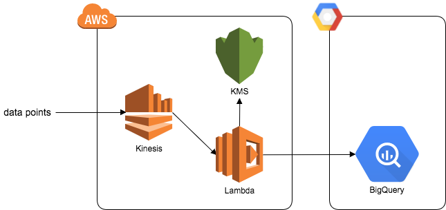

# Terraformによるマルチクラウドプラットフォームインフラストラクチャ

* KinesisとBigQueryを使ったデータ解析基盤を構築する
* レコード100件ごとにLambda実行(バッチサイズ100)
* BigQueryにレコードを追加するためのCredentialは、KMSで暗号化した値を環境変数BQ_CREDENTIALSに設定してLamdaに渡す
  - LambdaのロールにKMSを扱うポリシーを付与しスクリプト内で復号化して使用する


## 構成




## 事前準備

* GCP接続用のcredentialファイル
    - var.google["credentials"]
    - Terraformで使用
        - BigQueryのデータセットを作成する
        - BigQueryのテーブルを作成する

* BigQuery用のcredentialファイル
    - var.bq["credentials"]
    - Lambdaで使用
        - BigQueryにレコードを追加する

* Lambdaスクリプトのための依存ライブラリ

    ```
    $ pip install gcloud -t lambda/kinesis2bq/vendor/
    ```

    - `gcloud`パッケージの利用で問題が発生した場合はこちらを試す
        - [AWS Lambda Python版でgcloudパッケージを利用しようとするとImportError - Qiita](http://qiita.com/runtakun/items/06b41dbff1cc683e48d8)

        ```
        $ test -e lambda/kinesis2bq/vendor/google/__init__.py || touch lambda/kinesis2bq/vendor/google/__init__.py
        ```

## テスト

* Kinesisにデータを投入

    データ作成

    ```
    $ TEST_JSON=$(mktemp)
    $ test/gen_kinesis_records.sh $KINESIS_STREAM_NAME >$TEST_JSON # デフォルトで300レコードのデータを作成
    $ cat $TEST_JSON | jq . -C | less -R
    ```

    データ投入

    ```
    $ aws kinesis put-records --cli-input-json file://$TEST_JSON
    ```

* BigQueryでデータを確認

    ```
    SELECT count(time) FROM [PROJECT:DATASET.TABLE];
    ```

うまくいかない場合はLambdaのログを確認する。

